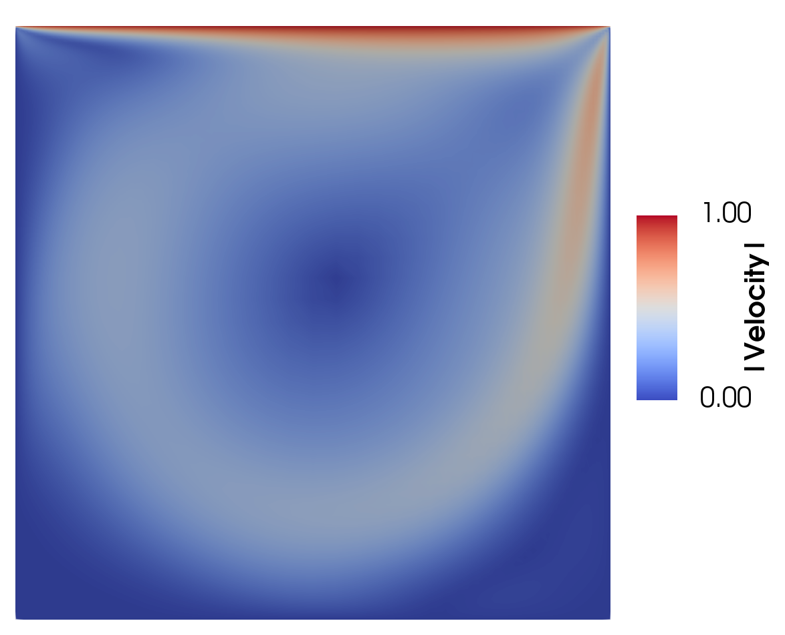
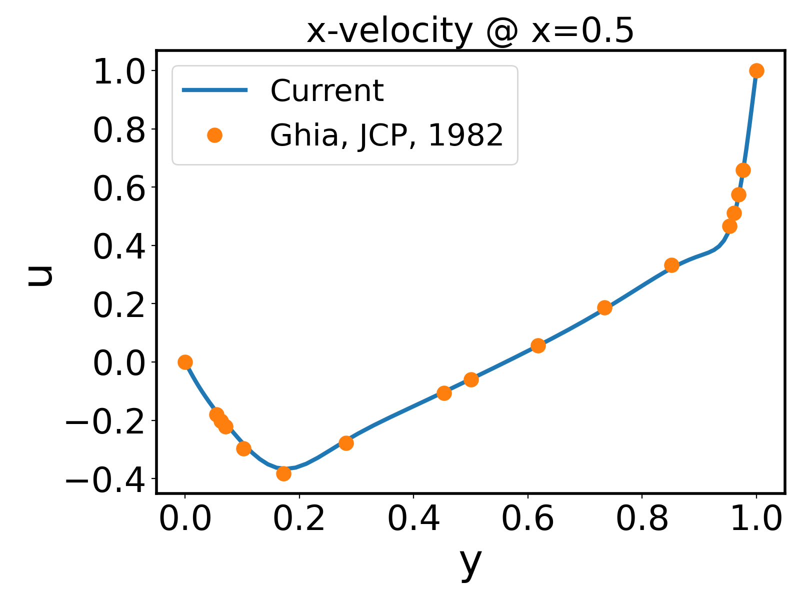
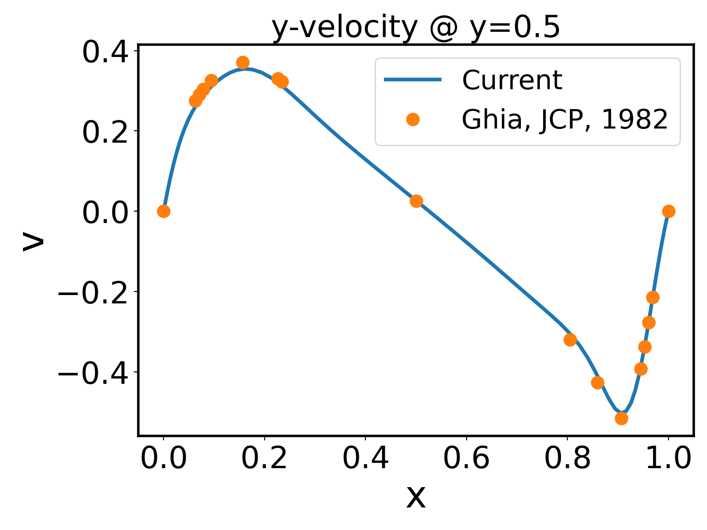

# **Problem Description**

Solve the classic 2D driven cavity flow problem. The flow field is plotted below.

<p align="center">
   
</p>

Current results also match well with [published results](./ref/LDC_Ghia.pdf).

<p align="center">
   
</p>

<p align="center">
   
</p>

The input file `svFSI.inp` follows the master input file [`svFSI_master.inp`](./svFSI_master.inp) as a template. Some specific input options are discussed below:

```
   Add BC: top {
      Type: Dir
      Value: 1.0
      Effective direction: (1, 0)
      Zero out perimeter: f
   }

   Add BC: top {
      Type: Dir
      Value: 0.0
      Effective direction: (0, 1)
      Zero out perimeter: f
   }
```

The top boundary has constant velocity in the x direction and zero velocity in the y direction. Here, `Effective direction` is used to enforce different velocity boundary conditions on the same boundary along different directions. Currently, it only supports axial directions, i.e. `(1, 0), (1, 0)` in 2D and `(1, 0, 0), (0, 1, 0), (0, 0, 1)` in 3D.
