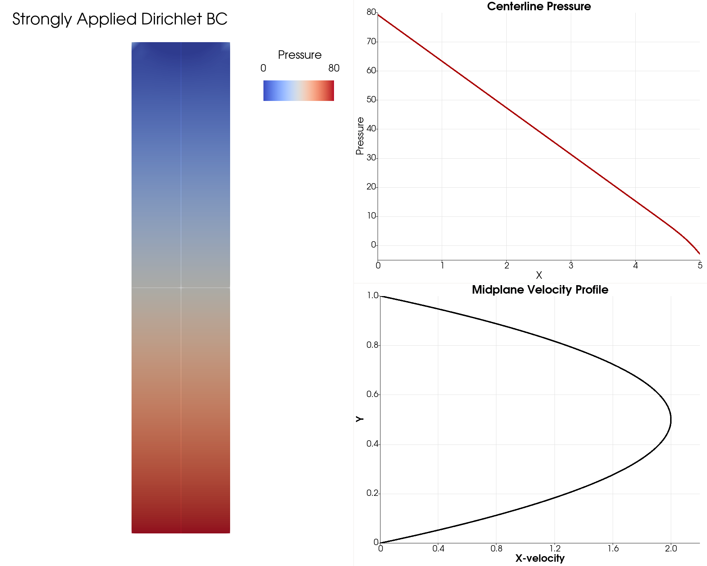

# **Problem Description**

Solve the classic 2D channel flow problem. The simulation results are plotted below.

<p align="center">
   
</p>

The input file `svFSI.inp` follows the master input file [`svFSI_master.inp`](./svFSI_master.inp) as a template. Some specific input options are discussed below:

```
   Use Taylor-Hood type basis: t
```

This is for P2P1 elements.
