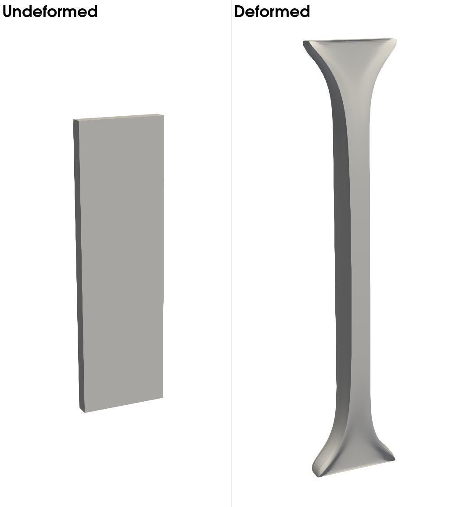

# **Problem Description**

Solve simple tension of arterial strip [1]. The arterial strip is clamped on the ends in the axial direction, where an axial loading is applied. Due to the symmetry of the problem, only 1/8 of the domain is solved. The following figure shows the complete undeformed geometry and deformed geometry ($\kappa=0$).

<p align="center">
   
</p>

The input file `svFSI.inp` follows the master input file [`svFSI_master.inp`](./svFSI_master.inp) as a template.  Some specific input options are discussed below:

## Undeforming Neumann BC

At the clamped end, the boundary will experience externally applied loading. Moreover, while the surface moves along the axial direction, there is no transversal displacement. This mixture of Neumann BC and Dirichlet BC poses significant challenges in this study. Here we have implemented a special `Undeforming Neu face`option for this kind of boundary conditions:

```
   Add BC: Z1 {
      Type: Neu
      Time dependence: Unsteady
      Temporal values file path: load.dat
      Ramp function: t
      Undeforming Neu face: t
   }
```


## Reference

1. Gasser, T. Christian, Ray W Ogden, and Gerhard A Holzapfel.  Hyperelastic Modelling of Arterial Layers with Distributed Collagen Fibre Orientations.  *Journal of The Royal Society Interface* 3, no. 6 (February 22, 2006): 15 35. https://doi.org/10.1098/rsif.2005.0073.

