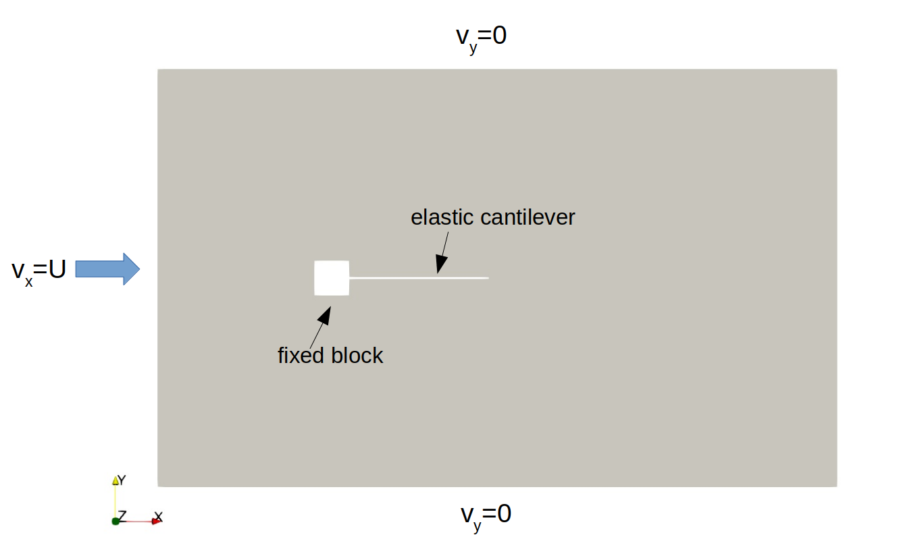
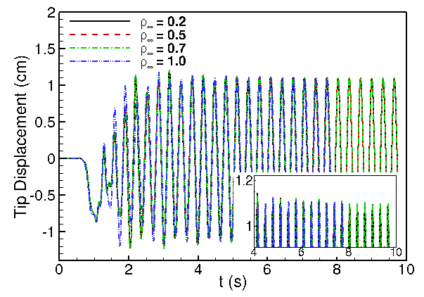

# **Problem Description**

Solve flow over an elastic cantilever using the Arbitrary Lagrangian-Eulerian method [1]. The problem set-up is as follows.

   

The tip of the cantilever will exhibit periodic oscillation after reaching stationary state. The following plot also demonstrates the effect of $\rho_\infty$ on the tip displacement amplitude.

   

The input file `svFSI.inp` follows the master input file [`svFSI_master.inp`](./svFSI_master.inp) as a template. More on ALE-FSI simulations can be found here:

- SimVascular Website: https://simvascular.github.io/docssvFSI-FSI.html
- Youtube Tutorial: https://www.youtube.com/watch?v=QIpyThIAD7k (This video is for flow inside a modeled aorta, but the general idea is also applicable to this case.)

## Reference

1. Liu, Ju, and Alison L. Marsden.  A Unified Continuum and Variational Multiscale Formulation for Fluids, Solids, and Fluid Structure Interaction.  *Computer Methods in Applied Mechanics and Engineering* 337 (August 2018): 549 97. https://doi.org/10.1016/j.cma.2018.03.045.
